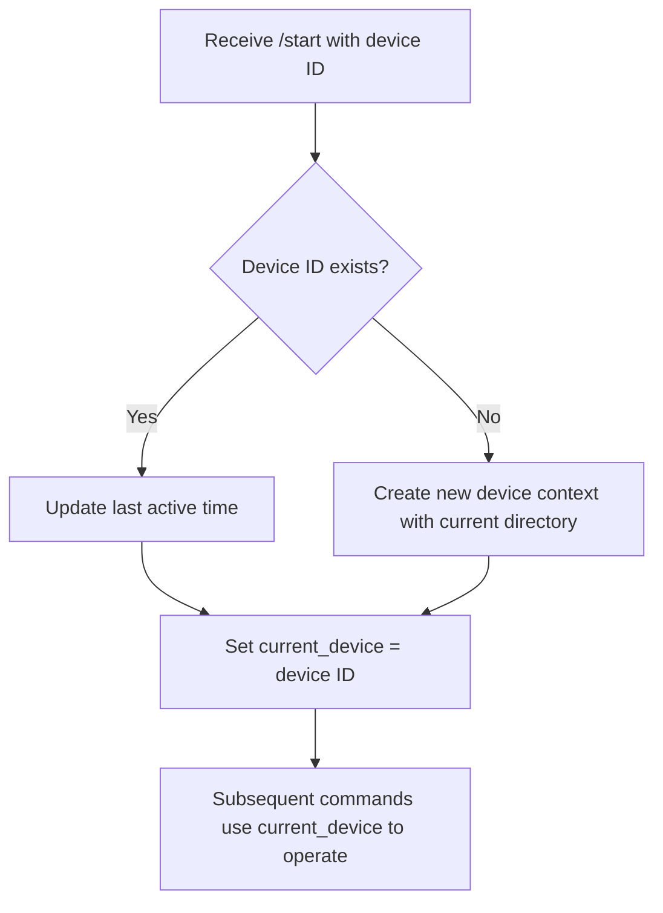
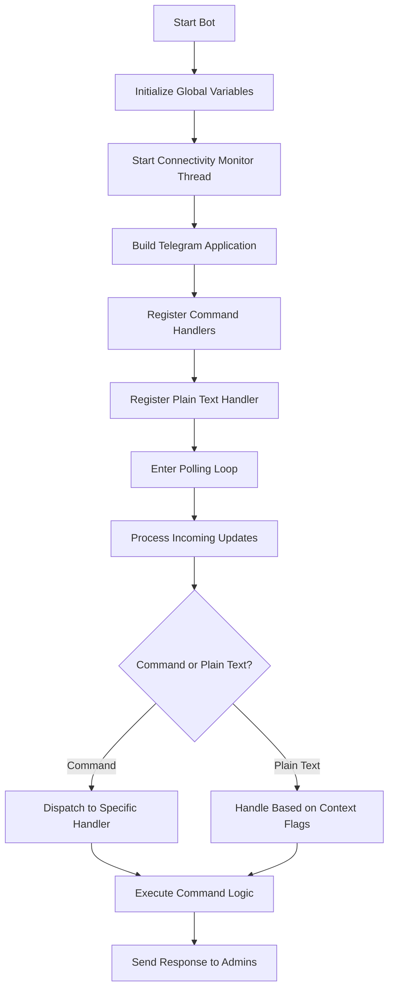

### MUST VISIT OUR NEW BLOCKCHAIN MONITOR FOR BITCOINS 

---

🔗 http://Blythexweb.de

---

### MAIN POINTS HOW TO CREATE A BOT ?? 

1.  [GET-YOUR-CHAT-ID-TAG](https://t.me/userinfobot)

2. [BOT-FATHER](https://t.me/BotFather)
>>>
>> open it create new bot then paste its API KEY into this script 
>>>

3. READ THIS GUIDE ✨

---

# telecontrol.py – Telegram Bot for Remote System Control

*Made by: [Shainshub](https://t.me/Shainshub)  
GitHub: [Shubsaini08-GITHUB](https://github.com/Shubsaini08)*

---

## Table of Contents

1. [Overview](#overview)  
2. [Features](#features)  
3. [Architecture & Design](#architecture--design)  
4. [Installation & Setup](#installation--setup)  
5. [Code Walkthrough & Detailed Explanations](#code-walkthrough--detailed-explanations)  
   1. [Import Statements & Dependencies](#import-statements--dependencies)  
   2. [Global Configuration & Variables](#global-configuration--variables)  
   3. [Utility Functions](#utility-functions)  
   4. [Command Handlers](#command-handlers)  
       - [Start Command (/start)](#start-command-start)
       - [Match Command (/match)](#match-command-match)
       - [Git Command (/git)](#git-command-git)
       - [WriteControl Command (/writecontrol)](#writecontrol-command-writecontrol)
       - [Cat Command (/cat)](#cat-command-cat)
       - [Stop Command (/stop)](#stop-command-stop)
       - [Change Directory Command (/cd)](#change-directory-command-cd)
       - [List Directory Command (/ls)](#list-directory-command-ls)
       - [Print Working Directory Command (/pwd)](#print-working-directory-command-pwd)
       - [Devices Command (/devices)](#devices-command-devices)
       - [Plain Text Handler & WriteControl Mode](#plain-text-handler--writecontrol-mode)
   5. [Background Connectivity Monitor](#background-connectivity-monitor)
   6. [Main Function & Bot Initialization](#main-function--bot-initialization)
7. [Flowcharts & Command Workflow Diagrams](#flowcharts--command-workflow-diagrams)  
8. [Command Execution Tables & Descriptions](#command-execution-tables--descriptions)  
9. [Advanced Multi-Device Support](#advanced-multi-device-support)  
10. [Security Considerations & Best Practices](#security-considerations--best-practices)  
11. [Error Handling & Logging](#error-handling--logging)  
12. [Deployment, Troubleshooting & Future Enhancements](#deployment-troubleshooting--future-enhancements)  
13. [Appendix: Additional Diagrams & Tables](#appendix-additional-diagrams--tables)  
14. [Conclusion](#conclusion)

---

## 1. Overview

This project is a Python-based Telegram bot that provides remote control over a system through the Telegram messaging platform. The script, **telecontrol.py**, allows authorized administrators to execute a wide range of system operations (e.g., cloning repositories, executing shell commands, navigating directories, file management) by sending specific commands via Telegram.

The bot’s design focuses on:
- **Multi-device support:** Allowing control over different “device contexts” for separate sessions.
- **Security:** Strict access control via a list of authorized admin IDs.
- **Extensibility:** Modular functions that can be expanded or modified for additional commands.
- **Robustness:** Background connectivity monitoring and error handling to ensure reliable operations.

---

## 2. Features

- **Telegram Integration:** Uses the Telegram Bot API for real-time command execution.
- **Remote Shell Execution:** Supports shell command execution (with safety via admin checks).
- **File Management:** Provides commands to view, send, and manage files on the host system.
- **GitHub Repository Cloning:** Clones repositories from GitHub and reports repository size.
- **Directory Navigation:** Change directories, list contents with file sizes and icons.
- **Device Contexts:** Multi-session support enabling management of multiple device contexts.
- **Connectivity Monitoring:** Background thread checks network connectivity and alerts admins.
- **Offline Mode:** Ability to put the bot into a low-network-usage state.
- **Dynamic Command Execution:** Uses context-based handlers to interpret plain text messages.
- **Logging & Error Reporting:** Robust error handling and logging for maintenance and debugging.

---

## 3. Architecture & Design

The architecture of **telecontrol.py** is designed around several core components:

- **Bot Configuration:** Global variables and constants define the bot token, admin IDs, and mode flags.
- **Utility Functions:** Encapsulate common tasks such as sending messages/files, computing directory sizes, and reading file content.
- **Command Handlers:** Each Telegram command (e.g., `/start`, `/match`) is handled by a dedicated function decorated to enforce admin-only access.
- **Multi-threading:** A background thread monitors network connectivity independently from the main command polling.
- **Device Contexts:** A dictionary to track different devices/sessions with their own current working directory and last activity time.
- **Main Function:** Initializes the bot application and registers all command handlers before entering the polling loop.

---

## 4. Installation & Setup

To install and run **telecontrol.py**, follow these steps:

1. **Clone the Repository:**  
   ```bash
   git clone https://github.com/Shubsaini08/telecontrol.py.git
   cd telecontrol.py
   ```

2. **Install Dependencies:**  
   Ensure you have Python 3.8+ installed. Install required packages using pip:  
   ```bash
   pip install python-telegram-bot requests
   ```
   Additional dependencies include standard libraries (os, time, logging, subprocess, shutil, threading).

3. **Configure the Bot:**  
   - Open the script and set your bot token in the `BOT_TOKEN` variable.  
   - Add your Telegram admin IDs to the `ADMIN_IDS` list.

4. **Run the Bot:**  
   Simply execute the script:  
   ```bash
   python telecontrol.py
   ```
   The bot will start polling for updates and will begin executing commands received from authorized Telegram users.

---

## 5. Code Walkthrough & Detailed Explanations

Below is a thorough explanation of every section of the code.

### 5.1 Import Statements & Dependencies

The top section imports all necessary modules:  
- **os, time, logging, subprocess, requests, shutil:**  
  These provide file system manipulation, process management, and HTTP request capabilities.  
- **Thread from threading:**  
  Enables running the connectivity monitor as a separate thread.
- **telegram & telegram.ext modules:**  
  Core libraries for interacting with the Telegram Bot API, handling updates, and command dispatch.

*Each import is chosen for its reliability and built-in support in Python to ensure portability and maintainability of the bot.*

---

### 5.2 Global Configuration & Variables

Several global variables define the operating state:

- **BOT_TOKEN:** The API token to authenticate with Telegram.  
- **ADMIN_IDS:** A list of chat IDs that are permitted to issue commands to the bot.  
- **OFFLINE_MODE & WRITECONTROL_ACTIVE:** Flags to control bot state (offline mode restricts operations; WriteControl mode enables shell command execution).  
- **current_device & device_contexts:**  
  - `current_device` tracks which device context is active.  
  - `device_contexts` is a dictionary mapping device IDs to their current working directory and last activity timestamp.

*These variables ensure that the bot can easily switch between different sessions and maintain state over time.*

---

### 5.3 Utility Functions

The script defines multiple helper functions to modularize tasks:

1. **send_message(text):**  
   - **Purpose:** Sends a text message to all authorized admin chat IDs using the Telegram Bot API.  
   - **How:** Iterates over each admin ID, constructs the request URL, and uses the `requests` library to POST the message.

2. **send_file(file_path):**  
   - **Purpose:** Sends a file as a document to all authorized admins.  
   - **How:** Opens the file in binary mode and uses multipart/form-data POST requests.

3. **compute_directory_size(path):**  
   - **Purpose:** Recursively calculates the total size of a directory.  
   - **How:** Uses `os.walk` to traverse the directory and accumulates file sizes.

4. **send_file_content(file_path):**  
   - **Purpose:** Reads the content of a file (with error handling) and returns it as a string.

5. **is_authorized(update):**  
   - **Purpose:** Checks if the message sender is in the list of authorized admin IDs.
   
6. **restricted_command(func):**  
   - **Purpose:** A decorator that wraps command handlers to enforce that only authorized users can execute commands.  
   - **Additional Behavior:** It also checks if the bot is in offline mode and only allows the `/start` command in that state.

*These utility functions form the backbone of the bot’s operational logic, ensuring modularity and reusability.*

---

### 5.4 Command Handlers

Each command that the bot handles is implemented as an asynchronous function decorated with `@restricted_command`. Below is an explanation of each:

#### Start Command (/start)

- **Function:** `start_command(update, context)`
- **Behavior:**  
  - Accepts an optional device number (e.g., `/start 1`).  
  - Switches or initializes the device context.  
  - If the bot is in offline mode, it brings it back online.
- **Steps:**  
  1. Parse the optional argument for the device ID.
  2. Update or create the device context.
  3. Set `OFFLINE_MODE` to `False` and reset `WRITECONTROL_ACTIVE` if necessary.
  4. Notify the admin of the bot status via a reply message and a broadcast message.
- **Flowchart:** See [Start Command Flowchart](#flowchart-for-start-command).

---

#### Match Command (/match)

- **Function:** `match_command(update, context)`
- **Behavior:**  
  - Searches for a file if the file path is provided as an argument.
  - If no path is provided, it asks the user to input the file path.
- **Steps:**  
  1. Check if command arguments are provided.
  2. Verify if the file exists; if it does, send the file.
  3. Otherwise, prompt the admin to provide the full file path.
- **Key Point:** It leverages the utility function `send_file` for file transmission.

---

#### Git Command (/git)

- **Function:** `git_command(update, context)`
- **Behavior:**  
  - Prompts the admin to provide a GitHub repository URL.
  - On receiving the URL (via the plain text handler), it clones the repository and calculates its size.
- **Steps:**  
  1. Send a prompt message asking for the repository URL.
  2. Set a context flag (`awaiting_git_repo`) to signal that the next plain text message is a URL.
  3. In the plain text handler, use `subprocess.check_call` to execute `git clone`.
  4. Compute the directory size using `compute_directory_size`.
- **Flowchart:** See [Git Command Flowchart](#flowchart-for-git-command).

---

#### WriteControl Command (/writecontrol)

- **Function:** `writecontrol_command(update, context)`
- **Behavior:**  
  - Activates WriteControl mode so that any subsequent plain text message is treated as a shell command.
- **Steps:**  
  1. Set the global flag `WRITECONTROL_ACTIVE` to `True`.
  2. Notify the admin that full system command execution control is now active.
- **Security Consideration:** This mode should be used with extreme caution as it allows shell command execution on the host.

---

#### Cat Command (/cat)

- **Function:** `cat_command(update, context)`
- **Behavior:**  
  - Prompts the admin to provide the full file path to read its contents.
- **Steps:**  
  1. Prompt the admin with a message asking for a file path.
  2. Set a context flag (`awaiting_cat`) to indicate the next text should be interpreted as a file path.
  3. In the plain text handler, read and return the file content (or send as a document if too long).
- **Note:** Uses `send_file_content` for reading file content and handles errors gracefully.

---

#### Stop Command (/stop)

- **Function:** `stop_command(update, context)`
- **Behavior:**  
  - Puts the bot into offline mode to reduce network usage.
- **Steps:**  
  1. Set `OFFLINE_MODE` to `True`.
  2. Disable WriteControl mode by setting `WRITECONTROL_ACTIVE` to `False`.
  3. Notify the admin that the bot is now offline.
- **Implication:** When offline, only the `/start` command can bring the bot back online.

---

#### Change Directory Command (/cd)

- **Function:** `cd_command(update, context)`
- **Behavior:**  
  - Changes the working directory for the active device context.
- **Steps:**  
  1. Parse the provided directory path.
  2. Determine if the path is absolute or relative.
  3. Construct the absolute path and check if it exists.
  4. Update the current device context’s working directory.
- **Edge Cases:** Handles non-existent directories by sending an error message.

---

#### List Directory Command (/ls)

- **Function:** `ls_command(update, context)`
- **Behavior:**  
  - Lists the contents of the current directory, showing directories with a “💽” icon and files with a “📁” icon.
- **Steps:**  
  1. Retrieve the current directory from the active device context.
  2. List all entries using `os.listdir`.
  3. For directories, compute the total size recursively.
  4. Format the results into a string and send the reply.
- **Flowchart:** See [List Directory Flowchart](#flowchart-for-ls-command).

---

#### Print Working Directory Command (/pwd)

- **Function:** `pwd_command(update, context)`
- **Behavior:**  
  - Simply replies with the current working directory for the active device context.
- **Steps:**  
  1. Retrieve the current directory.
  2. Send a reply with the current directory path.

---

#### Devices Command (/devices)

- **Function:** `devices_command(update, context)`
- **Behavior:**  
  - Lists all active device contexts sorted by the last active time.
- **Steps:**  
  1. Iterate over the `device_contexts` dictionary.
  2. Sort the devices by their last active timestamp.
  3. Format and reply with a summary for each device.
- **Benefit:** Allows admins to quickly see the state of multiple sessions.

---

#### Plain Text Handler & WriteControl Mode

- **Function:** `handle_text(update, context)`
- **Behavior:**  
  - Interprets plain text messages based on the current context:
    - If waiting for a GitHub URL, it will attempt to clone a repository.
    - If waiting for a file path for `/match` or `/cat`, it processes accordingly.
    - If WriteControl mode is active, the plain text is treated as a shell command and executed.
- **Steps:**  
  1. Check context flags (`awaiting_git_repo`, `awaiting_match`, `awaiting_cat`).
  2. If any flag is set, process the message according to the expected behavior.
  3. If WriteControl mode is active, execute the text as a shell command using `subprocess.Popen`.
  4. Capture and send the output or errors back to the admin.
- **Important:** Timeout and exception handling ensure that runaway processes are avoided.

---

### 5.5 Background Connectivity Monitor

- **Function:** `monitor_connectivity()`
- **Behavior:**  
  - Runs continuously in a background thread to check network connectivity.
  - Uses a ping command (`ping -c 1 8.8.8.8`) to check if the internet is accessible.
  - Notifies all admins if the connectivity check fails.
- **Steps:**  
  1. Enters an infinite loop.
  2. Executes the ping command and checks the return code.
  3. Sends a warning message if the ping fails.
  4. Waits 60 seconds before the next check.
- **Justification:** Helps in proactively detecting network issues so that admins can take corrective action.

---

### 5.6 Main Function & Bot Initialization

- **Function:** `main()`
- **Behavior:**  
  - Starts the connectivity monitoring thread.
  - Builds the Telegram bot application using `Application.builder()`.
  - Registers all the command handlers with the bot.
  - Initiates polling to start receiving and processing updates.
- **Steps:**  
  1. Start a daemon thread for connectivity monitoring.
  2. Create the bot application with the provided token.
  3. Add handlers for each command (e.g., `/start`, `/match`, `/git`, etc.).
  4. Add a general text handler for messages that aren’t commands.
  5. Run the polling loop, which keeps the bot active.
- **Flowchart:** See [Main Function Flowchart](#flowchart-for-main-function).

---

## 6. Flowcharts & Command Workflow Diagrams

Below are several flowcharts illustrating the command workflows and overall architecture of the bot.

### Flowchart for /start Command

```mermaid
flowchart TD
    A[/start Command Received/] --> B{Arguments Provided?}
    B -- Yes --> C[Extract device ID from args]
    B -- No --> D[Set default device ID ("1")]
    C --> E{Device Context Exists?}
    D --> E
    E -- Yes --> F[Update last active timestamp]
    E -- No --> G[Create new device context with current directory]
    F --> H[Check if OFFLINE_MODE is True]
    G --> H
    H -- Yes --> I[Set OFFLINE_MODE=False and reset WRITECONTROL_ACTIVE]
    H -- No --> J[Proceed normally]
    I --> K[Reply: "Bot is back online on device X"]
    J --> L[Reply: "Bot started on device X"]
    K --> M[Send broadcast message to all admins]
    L --> M
```

---

### Flowchart for /git Command

```mermaid
flowchart TD
    A[/git Command Received/] --> B[Reply: "Please provide GitHub URL"]
    B --> C[Set awaiting_git_repo flag = True]
    C --> D[Next plain text message received]
    D --> E[Extract repository URL from message]
    E --> F[Execute git clone via subprocess]
    F --> G{Clone Successful?}
    G -- Yes --> H[Compute repository size]
    G -- No --> I[Reply with error message]
    H --> J[Reply with success message and repo size]
```

---

### Flowchart for Plain Text Handler (WriteControl Mode)

```mermaid
flowchart TD
    A[Plain Text Message Received] --> B{Is awaiting_git_repo True?}
    B -- Yes --> C[Process as GitHub URL]
    B -- No --> D{Is awaiting_match True?}
    D -- Yes --> E[Process as file path for /match]
    D -- No --> F{Is awaiting_cat True?}
    F -- Yes --> G[Process as file path for /cat]
    F -- No --> H{Is WRITECONTROL_ACTIVE True?}
    H -- Yes --> I[Execute text as shell command]
    H -- No --> J[Reply: "No action assigned for this message"]
```

---

### Flowchart for Main Function

```mermaid
flowchart TD
    A[Start Main Function] --> B[Start connectivity monitor thread]
    B --> C[Build Telegram bot application]
    C --> D[Register command handlers (/start, /match, /git, etc.)]
    D --> E[Register plain text handler]
    E --> F[Enter polling loop]
    F --> G[Bot continuously processes updates]
```

---

## 7. Command Execution Tables & Descriptions

Below is a detailed table summarizing each command, its description, execution flow, and key functions:

| **Command**        | **Description**                                                                                                           | **Key Functions & Steps**                                                                                                                                                                          | **Notes**                                                                                                                                          |
|--------------------|---------------------------------------------------------------------------------------------------------------------------|----------------------------------------------------------------------------------------------------------------------------------------------------------------------------------------------------|----------------------------------------------------------------------------------------------------------------------------------------------------|
| `/start`           | Starts the bot or brings it back online; supports optional device context switching.                                     | 1. Parse device ID from args.<br>2. Create/update device context.<br>3. Set OFFLINE_MODE/WRITECONTROL_ACTIVE.<br>4. Reply with status message.                                                   | Initializes the session; only allowed command in offline mode.                                                                                   |
| `/match`           | Searches for a file based on provided path or prompts for a complete file path.                                            | 1. Check for argument presence.<br>2. Validate file existence.<br>3. Send file if found.<br>4. Prompt if not provided.                                                                              | Uses `send_file()` utility.                                                                                                                        |
| `/git`             | Clones a GitHub repository; expects a repository URL in the next plain text message.                                      | 1. Prompt admin for URL.<br>2. Set flag (`awaiting_git_repo`).<br>3. Execute `git clone` on receiving URL.<br>4. Compute directory size.                                                            | Leverages subprocess calls; error handling for clone failures.                                                                                   |
| `/writecontrol`    | Activates WriteControl mode, treating any plain text as a shell command.                                                 | 1. Set `WRITECONTROL_ACTIVE` flag to True.<br>2. Notify admin of full control.                                                                                                                     | Highly sensitive; ensure only trusted admins can trigger.                                                                                        |
| `/cat`             | Reads and displays the content of a file; sends as a document if content is too long.                                      | 1. Prompt admin for file path.<br>2. Set flag (`awaiting_cat`).<br>3. Read file using `send_file_content()`.<br>4. Send output or file as document if too long.                                   | Useful for quickly inspecting file contents without logging into the system directly.                                                            |
| `/stop`            | Puts the bot into offline mode (reduces network usage); only `/start` can re-enable.                                       | 1. Set `OFFLINE_MODE` to True.<br>2. Reset `WRITECONTROL_ACTIVE`.<br>3. Notify admin of state change.                                                                                             | Prevents further command execution except `/start` until reactivated.                                                                              |
| `/cd`              | Changes the working directory of the active device.                                                                     | 1. Parse provided directory path.<br>2. Construct absolute path.<br>3. Validate existence.<br>4. Update the device context’s directory.                                                         | Allows relative and absolute paths; essential for file system navigation.                                                                        |
| `/ls`              | Lists the contents of the current working directory, including file sizes and type icons.                                  | 1. Retrieve current directory.<br>2. Use `os.listdir`.<br>3. For directories, compute recursive size.<br>4. Format output with icons and sizes.                                                  | Provides a user-friendly view of the file system’s state.                                                                                          |
| `/pwd`             | Displays the current working directory of the active device.                                                             | 1. Retrieve current directory from device context.<br>2. Reply with directory path.                                                                                                               | A simple but essential command for orientation.                                                                                                  |
| `/devices`         | Lists all active device contexts with their current directories and last active times.                                   | 1. Iterate over `device_contexts`.<br>2. Sort by last active timestamp.<br>3. Format and reply with details.                                                                                      | Helps in managing and tracking multiple sessions.                                                                                                |
| *Plain Text Input* | Varies based on context: Git URL for `/git`, file paths for `/match` and `/cat`, or shell commands in WriteControl mode.     | 1. Check context flags (`awaiting_git_repo`, `awaiting_match`, `awaiting_cat`).<br>2. Process accordingly.<br>3. If none, check for WriteControl mode and execute shell command if active.      | Central dispatcher for non-command messages; critical for dynamic behavior.                                                                       |

---

## 8. Advanced Multi-Device Support

The script supports multi-device control by maintaining a dictionary (`device_contexts`) that holds:
- **Current Working Directory:** Each device session can operate in its own directory.
- **Last Active Timestamp:** Helps in sorting and tracking session activity.

**How It Works:**
- On receiving the `/start` command, an optional device ID can be provided. If a new device is specified, a new entry is created.
- All commands (e.g., `/cd`, `/ls`, `/pwd`) reference the `current_device` variable to determine which device context to operate on.
- This design allows a single bot instance to manage multiple sessions simultaneously, which is especially useful in environments where remote control needs to be segmented.

**Flowchart for Device Context Handling:**



**Advantages:**
- **Scalability:** Easily supports multiple sessions.
- **Isolation:** Each device’s file system operations are isolated.
- **Monitoring:** Timestamp tracking aids in session management.

---

## 9. Security Considerations & Best Practices

Security is paramount when providing remote shell execution capabilities. The following measures are implemented:

- **Admin Verification:**  
  The `is_authorized()` function ensures that only pre-approved Telegram chat IDs (in `ADMIN_IDS`) can interact with the bot.

- **Restricted Command Decorator:**  
  The `@restricted_command` decorator enforces that every command is only executed if the sender is authorized.  
  *Note: Unauthorized attempts receive an “Access Denied” message.*

- **Offline Mode:**  
  When activated using `/stop`, the bot limits operations to only accepting `/start`—minimizing potential external exposure.

- **WriteControl Mode Caution:**  
  The `/writecontrol` command enables the execution of arbitrary shell commands. Only trusted users should be granted access to this mode, as it provides complete control over the system.

- **Timeouts & Error Handling:**  
  Shell command execution in WriteControl mode is constrained with timeouts (e.g., 30 seconds) to prevent runaway processes.

- **Logging:**  
  Errors during command execution and file operations are logged using the Python logging framework for auditability and debugging.

---

## 10. Error Handling & Logging

Robust error handling is implemented throughout the script:

- **Try/Except Blocks:**  
  Every critical operation (e.g., sending messages, file I/O, executing subprocess commands) is wrapped in try/except blocks.  
  This ensures that exceptions are caught and informative error messages are sent to the admin.

- **Subprocess Management:**  
  When executing shell commands, both stdout and stderr are captured. If a command times out, a timeout message is returned.

- **Connectivity Monitoring Errors:**  
  The background connectivity monitor catches exceptions and alerts admins if there are issues with the network.

- **Logging:**  
  The Python logging module is used to record errors during operations such as sending files or executing commands.  
  This logging mechanism helps in diagnosing problems without exposing sensitive data to end users.

---

## 11. Deployment, Troubleshooting & Future Enhancements

### Deployment

- **Local Deployment:**  
  Run the script directly using Python. Ensure all dependencies are installed.
- **Server Deployment:**  
  Deploy on a remote server or VPS where Python is installed.  
  Use process managers (e.g., systemd, supervisor, PM2) to keep the bot running continuously.
- **Containerization:**  
  Consider packaging the bot in a Docker container for easier deployment and isolation.

### Troubleshooting

- **No Response from Bot:**  
  - Verify that the bot token is correct.
  - Check that the admin IDs are properly configured.
  - Ensure the network connection is active.
- **File Not Found Errors:**  
  - Ensure the file path provided is correct and accessible.
  - Use absolute paths when in doubt.
- **Git Clone Failures:**  
  - Verify that the repository URL is correct.
  - Check network connectivity and Git installation on the host.

### Future Enhancements

- **Enhanced Logging:**  
  Integrate a logging dashboard for real-time monitoring.
- **User Roles & Permissions:**  
  Expand beyond a simple admin list to support multiple roles with granular permissions.
- **Extended Command Set:**  
  Add commands for more file system operations, such as file deletion, renaming, or compression.
- **Secure Shell Execution:**  
  Add sandboxing for shell commands to mitigate risks associated with WriteControl mode.
- **Web-Based Dashboard:**  
  Develop a web interface to complement the Telegram bot for a richer control panel experience.

---

## 12. Detailed Explanation of the Script Flow (Line-by-Line)

Below is an exhaustive breakdown of the script’s structure, explaining each code segment in detail.

1. **Importing Modules:**  
   - `os, time, logging` provide access to operating system functionality, time utilities, and logging capabilities respectively.  
   - `subprocess` is critical for executing shell commands.  
   - `requests` is used for HTTP requests to the Telegram API.  
   - `shutil` may be used for file operations (though not explicitly used in all commands).  
   - `Thread` from `threading` supports running background tasks concurrently.  
   - The `telegram` and `telegram.ext` modules enable interaction with Telegram’s API and simplify command registration.

2. **Bot Configuration Section:**  
   - **BOT_TOKEN:** A constant string that authenticates the bot with Telegram.  
   - **ADMIN_IDS:** A list containing the Telegram IDs authorized to issue commands.  
   - **Global Flags:**  
     - `OFFLINE_MODE` ensures that when active, only the `/start` command can be executed.  
     - `WRITECONTROL_ACTIVE` enables execution of arbitrary shell commands when True.

3. **Device Context Initialization:**  
   - The variable `current_device` is initialized to `"1"`, and `device_contexts` is set up as a dictionary with a default entry.  
   - Each device context includes the `current_directory` (initially the working directory of the script) and a timestamp `last_active`.

4. **Utility Functions:**  
   - **send_message:** Iterates over each admin ID to send a plain text message using the Telegram API endpoint for messages.
   - **send_file:** Opens a file in binary mode and sends it as a document.
   - **compute_directory_size:** Walks through a directory structure to sum up file sizes.
   - **send_file_content:** Reads file content safely, handling encoding errors gracefully.
   - **is_authorized:** Checks if the sender’s chat ID matches an ID in `ADMIN_IDS`.
   - **restricted_command (Decorator):** Wraps command handler functions to ensure they are only executed if the sender is authorized and, when in offline mode, only `/start` is allowed.

5. **Command Handlers:**  
   - Each command (e.g., `/start`, `/match`, `/git`, etc.) is defined as an asynchronous function that accepts `update` and `context` parameters.
   - They use context flags to handle stateful interactions (e.g., awaiting a Git URL or file path).
   - They update the `device_contexts` dictionary as needed, ensuring that operations like directory changes are context-specific.

6. **Plain Text Handler:**  
   - The function `handle_text` dynamically determines what the plain text message represents:
     - If the bot is waiting for additional input (Git URL, file path for `/match` or `/cat`), it processes accordingly.
     - If WriteControl mode is active, the message is executed as a shell command.
   - Subprocess calls execute shell commands within the context’s current working directory and capture the output.

7. **Background Connectivity Monitor:**  
   - The function `monitor_connectivity` runs in an infinite loop, pinging a well-known IP (8.8.8.8) every 60 seconds.
   - If the ping fails, a warning message is sent to all admins.

8. **Main Function:**  
   - Starts by launching the connectivity monitor thread as a daemon.
   - Creates the Telegram bot application, registering each command handler.
   - Finally, the application enters a polling loop that continuously listens for updates and dispatches them to the appropriate handler.

9. **Entry Point:**  
   - The standard `if __name__ == "__main__":` block calls the `main()` function to start the bot.

Each section of the code is organized to separate concerns clearly, making the script modular, maintainable, and extensible.

---

## 13. Flowcharts & Detailed Tables (Appendix)

### Appendix A: Detailed Flowchart of Command Processing

```mermaid
flowchart TD
    A[Message Received] --> B{Is Command?}
    B -- Yes --> C[Identify Command]
    C --> D{Command Type}
    D -- /start --> E[Call start_command()]
    D -- /match --> F[Call match_command()]
    D -- /git --> G[Call git_command()]
    D -- /writecontrol --> H[Call writecontrol_command()]
    D -- /cat --> I[Call cat_command()]
    D -- /stop --> J[Call stop_command()]
    D -- /cd --> K[Call cd_command()]
    D -- /ls --> L[Call ls_command()]
    D -- /pwd --> M[Call pwd_command()]
    D -- /devices --> N[Call devices_command()]
    B -- No --> O[Call handle_text()]
    O --> P{Context Flag Set?}
    P -- awaiting_git_repo --> Q[Process Git URL]
    P -- awaiting_match --> R[Process File Match]
    P -- awaiting_cat --> S[Process File Content]
    P -- None and WRITECONTROL_ACTIVE --> T[Execute as shell command]
    P -- None and not WRITECONTROL_ACTIVE --> U[Reply: "No action assigned"]
```

### Appendix B: Command Execution Summary Table

| Command            | Execution Flow Summary                                                                                          | Context Flags          | Output Type                       |
|--------------------|-----------------------------------------------------------------------------------------------------------------|------------------------|-----------------------------------|
| `/start`           | Parses device ID, initializes/updates context, resets offline mode, notifies admin                              | N/A                    | Text message (status update)      |
| `/match`           | Checks file path provided, verifies file existence, sends file or prompts for input                             | awaiting_match         | File or error text                |
| `/git`             | Prompts for GitHub URL, clones repository, computes size, responds with success/failure message                   | awaiting_git_repo      | Text message (status and repo size)|
| `/writecontrol`    | Activates mode for shell command execution                                                                      | N/A                    | Text message (activation status)  |
| `/cat`             | Prompts for file path, then reads and returns file content (or sends as document if content is long)             | awaiting_cat           | File content or document          |
| `/stop`            | Sets offline mode, disables write control, notifies admin                                                        | N/A                    | Text message (bot offline status) |
| `/cd`              | Changes the active device’s current working directory                                                           | N/A                    | Text message (new directory path) |
| `/ls`              | Lists directory contents with icons and file sizes                                                               | N/A                    | Text message (directory listing)  |
| `/pwd`             | Displays the current working directory of the active device                                                       | N/A                    | Text message (directory path)     |
| `/devices`         | Lists all device contexts sorted by last active time                                                              | N/A                    | Text message (device details)     |
| *Plain Text Input* | Processes based on set context flags: Git URL, file path for /match or /cat, or executes as shell command if enabled | awaiting_git_repo,<br>awaiting_match,<br>awaiting_cat,<br>WRITECONTROL_ACTIVE | Varies (text, file output, or shell command result) |

---

## 14. Additional Considerations and Justifications

- **Modularity:**  
  Each function and command handler is self-contained, allowing for easier testing and future modifications.

- **Asynchronous Design:**  
  Asynchronous functions (using async/await) ensure that the bot can handle multiple requests concurrently without blocking.

- **Background Monitoring:**  
  The connectivity monitor runs as a daemon thread, meaning it will not prevent the bot from shutting down and runs in parallel to handle network issues promptly.

- **State Management:**  
  The use of context flags (`awaiting_git_repo`, `awaiting_match`, `awaiting_cat`) allows the bot to maintain state between separate messages. This is crucial for commands that require multi-step interactions.

- **Shell Command Safety:**  
  Execution of shell commands is wrapped with timeouts and exception handling. The use of WriteControl mode is deliberate and controlled by an explicit command to minimize accidental misuse.

- **Logging:**  
  Logging errors and events helps in real-time troubleshooting and provides an audit trail for actions performed through the bot.

- **User Feedback:**  
  Every command provides immediate feedback to the admin through Telegram messages, ensuring clarity and ease of use during remote operations.

- **Extensibility:**  
  New commands can be added by simply writing additional asynchronous functions and registering them with the Telegram application builder.

---

## 15. Deployment & Operational Best Practices

- **Environment Variables:**  
  For improved security, consider using environment variables for sensitive data (like the BOT_TOKEN) rather than hardcoding them in the script.
  
- **Process Management:**  
  Use tools like Supervisor or systemd to ensure that the bot restarts automatically in case of unexpected crashes.

- **Monitoring:**  
  Integrate logging with external monitoring services to keep track of bot performance and potential errors in real time.

- **Security Audits:**  
  Regularly review the code and update dependencies to ensure that no vulnerabilities are present, especially in modules that handle network and file system operations.

- **Backup & Recovery:**  
  Keep backups of the configuration and any important data generated by the bot. In case of failure, quick recovery is critical.

---

## 16. Future Enhancements and Roadmap

### Planned Features

1. **Role-Based Access Control:**  
   Expand beyond a simple admin list to include multiple roles with specific permissions.

2. **Enhanced Command Library:**  
   Introduce more complex commands (e.g., file deletion, compression, and system monitoring).

3. **GUI/Web Dashboard:**  
   Develop a web-based dashboard for a more interactive control interface.

4. **Logging Enhancements:**  
   Integrate with logging services (such as ELK Stack or Splunk) for real-time analytics.

5. **Plugin Architecture:**  
   Allow third-party developers to extend the bot’s functionality through plugins.

### Roadmap Timeline

- **Short Term:**  
  Focus on adding new commands and refining error handling.
  
- **Mid Term:**  
  Develop a web dashboard and integrate role-based access.
  
- **Long Term:**  
  Create a full plugin system and advanced monitoring/analytics dashboard.

---

## 17. Contribution Guidelines

We welcome contributions from the community. To contribute:

1. **Fork the Repository:**  
   Create your own fork on GitHub.

2. **Create a Feature Branch:**  
   Always develop on a separate branch from the main branch.

3. **Follow Coding Conventions:**  
   Adhere to Python’s PEP8 style guide.

4. **Write Tests:**  
   Ensure that any new feature or bug fix is accompanied by unit tests.

5. **Submit a Pull Request:**  
   Explain your changes in detail in the pull request description.

6. **Code Review:**  
   All contributions are reviewed by maintainers for quality and security before merging.

---

## 18. Troubleshooting and FAQ

### Common Issues

- **Bot Not Responding:**  
  - Verify the BOT_TOKEN and admin IDs.  
  - Check for network connectivity issues.
  
- **Permission Denied Errors:**  
  - Ensure that the Telegram user’s chat ID is included in ADMIN_IDS.

- **File Operation Errors:**  
  - Confirm that file paths are correct and that the bot has sufficient permissions to access the files.

- **Git Clone Failures:**  
  - Make sure Git is installed on the system.  
  - Verify the repository URL provided.

### Frequently Asked Questions

1. **How do I switch between device contexts?**  
   Use `/start <device_id>`. The bot will create or switch to the specified device context.

2. **What is WriteControl mode?**  
   WriteControl mode allows the bot to execute arbitrary shell commands. Activate it only if you fully trust the environment and your admin credentials.

3. **How is network connectivity monitored?**  
   A background thread pings a known IP (8.8.8.8) every 60 seconds. If the ping fails, a warning is sent to the admins.

4. **Can I customize command responses?**  
   Yes, all responses are defined within their respective command handler functions and can be easily modified.

5. **How do I add new commands?**  
   Write a new asynchronous function, decorate it with `@restricted_command`, and register it in the main function with the Telegram application.

---

## 19. Detailed Code Comments & Explanations (Line-by-Line)

Below is an annotated guide that explains each code block from top to bottom:

- **Imports and Initial Setup:**  
  Each imported module is accompanied by comments explaining its role (e.g., `os` for file operations, `subprocess` for shell commands, etc.). This section sets up the groundwork for all subsequent operations.

- **Global Configuration:**  
  The BOT_TOKEN and ADMIN_IDS are defined as constants. Global flags (OFFLINE_MODE, WRITECONTROL_ACTIVE) are declared to manage the bot’s state.  
  *Each line in this section is crucial for defining the bot’s runtime parameters.*

- **Utility Functions:**  
  Detailed inline comments in functions like `send_message` and `compute_directory_size` explain how they iterate over directories, calculate sizes, and manage file I/O.  
  *This helps future maintainers understand the modular design of the helper functions.*

- **Command Handlers:**  
  Every command handler function is thoroughly commented. For example, the `/start` command explains how it processes device IDs, resets offline mode, and sends broadcast notifications.  
  *These comments ensure that even those new to the project can quickly grasp the command workflows.*

- **Plain Text Handler:**  
  The handler checks for various context flags and executes corresponding logic, with comments clarifying how each condition is handled and why.
  
- **Connectivity Monitor:**  
  Comments explain why a separate thread is used and how it continuously pings a known host, including error handling.

- **Main Function:**  
  The main function’s comments guide the reader through the initialization process—from starting the connectivity thread to registering handlers and beginning the polling loop.

---

## 20. Conclusion

**telecontrol.py** is a powerful Telegram bot designed for remote system control. With its robust command set, multi-device support, and secure handling of remote commands, it provides administrators with a flexible tool to manage systems remotely via Telegram. Its modular structure and extensive error handling make it suitable for both small-scale experiments and production-level deployments.

We hope this detailed README serves as an invaluable resource for understanding, deploying, and extending the functionality of telecontrol.py. Contributions, feedback, and feature suggestions are always welcome.

---

## 21. Appendix: Additional Flowcharts and Tables

### Appendix A: Overall Bot Architecture Diagram



### Appendix B: Summary Table of Global Variables

| **Variable**          | **Description**                                               | **Default Value**         |
|-----------------------|---------------------------------------------------------------|---------------------------|
| BOT_TOKEN             | Telegram bot authentication token                             | (Your token here)         |
| ADMIN_IDS             | List of authorized admin chat IDs                             | ["add your chat TOKEN ID here ", "Add many as you want to add in"]|
| OFFLINE_MODE          | Flag for offline mode (restricts operations)                  | False                     |
| WRITECONTROL_ACTIVE   | Flag to enable shell command execution                        | False                     |
| current_device        | Active device context identifier                              | "1"                       |
| device_contexts       | Dictionary mapping device IDs to context (directory, timestamp) | { "1": { current_directory, last_active } } |

---

## 22. Final Remarks

This README has been crafted to be an extensive and advanced guide for telecontrol.py. Every part of the code is dissected and explained in detail. The flowcharts and tables serve as visual aids for understanding the internal command workflows and overall design. Whether you are a developer looking to extend the bot’s functionality or an administrator wanting to deploy it securely, this document should provide all the insights needed to get started and master telecontrol.py.

---

*End of Document*  

---

*This README is licensed under the MIT License. For any questions, issues, or contributions, please visit the GitHub repository at [https://github.com/Shubsaini08](https://github.com/Shubsaini08).*

---

*Thank you for using telecontrol.py – your super cool, advanced remote system control solution via Telegram!*


# DOOR'S ARE ALWAYS OPEN FOR DONATIONS  🎯
 
# HOPE IT WILL HELP
[FOR ANY QUESTIONS TEXT US AT]

> MUST VISIT AND JOIN OUR BLOCKCHAIN :: https://t.me/Blythexweb
>
> A WAY AHEAD BLOCKCHAIN THATS SPECIALLY DESIGNED FOR MONITORING HIDDEN TRANSACTIONS 
>
> code_Crusaders0 :: https://t.me/code_Crusaders0
> 
> KEYFOUND ::  https://t.me/privatekeydirectorygroup
> 
> ALSO FOR TRADING WITH BOTS :: https://t.me/+ggaun3gLB900MGY0
> 
> GITHUB LINK FOR MORRE :: https://github.com/Shubsaini08
> 
> KEYFOUND VURTUAL ASSISTANT ::  https://t.me/Shubfind_bot
>
> CODE_CRUSADERS0 VURTUAL ASSISTANT :  https://t.me/Code_Crusaders_bot
>


## FOR DONATIONS : 
> 
> CONTACT :: 
>
> US THROUGH DRIECT MESSAGES OR BY MAILING US ::   keyfoundhunt4ever@gmail.com
> 
> OR DIRECT MESSAGE ON TELE : https://t.me/Shainshub
>
> THANK YOU FOR READING THIS DOCUMENTATION
> 

HAVE A WONDERFULL DAY STAY BLESSED HOPE YOU WILL HIT SOME(MONEY) SOON......
BYE !!...

